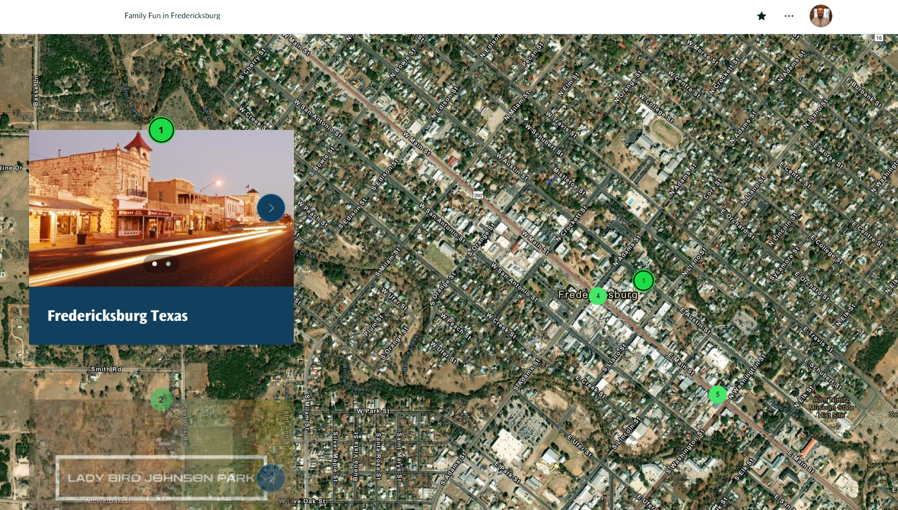
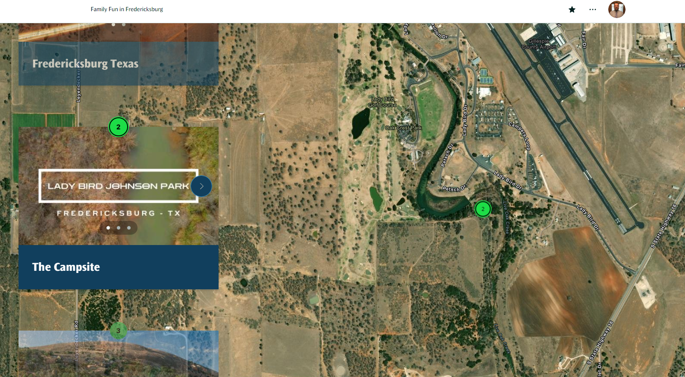
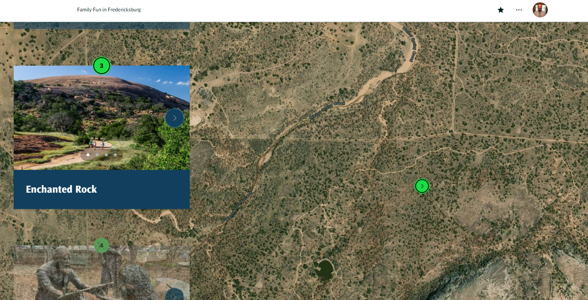
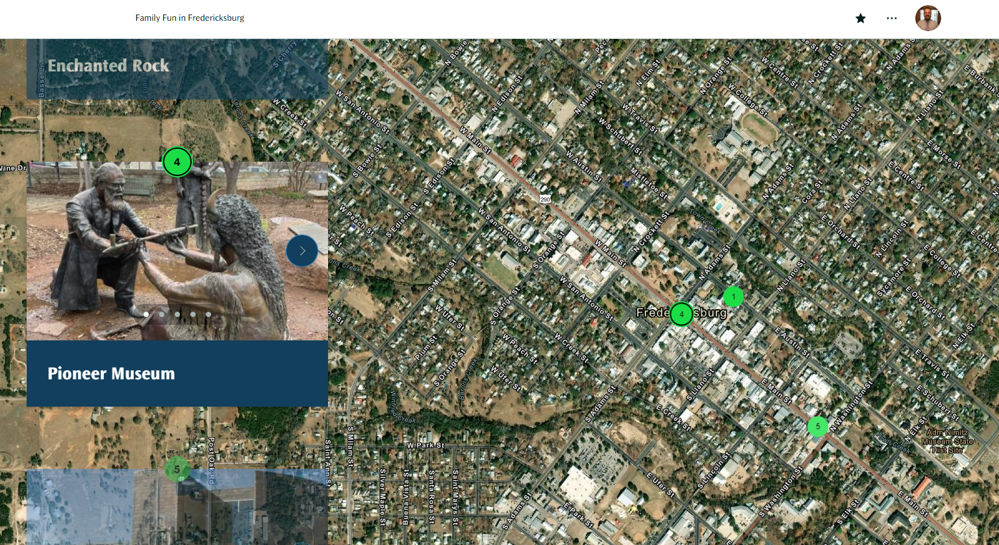
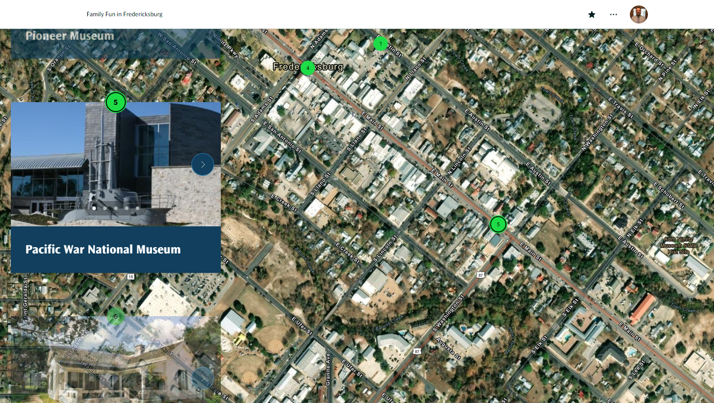
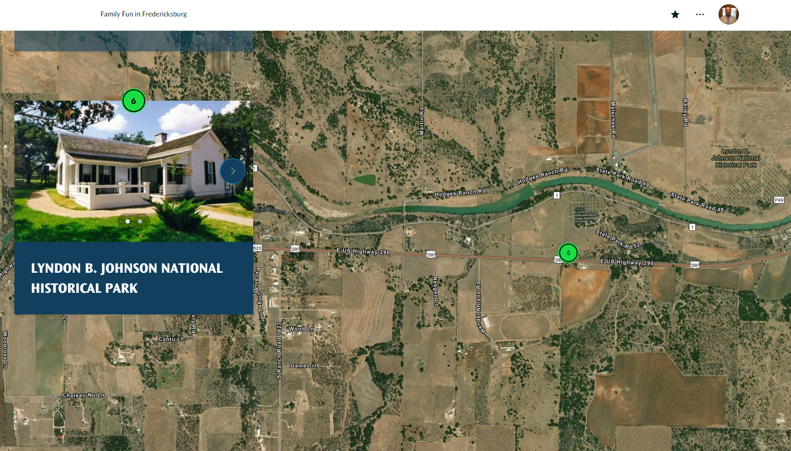
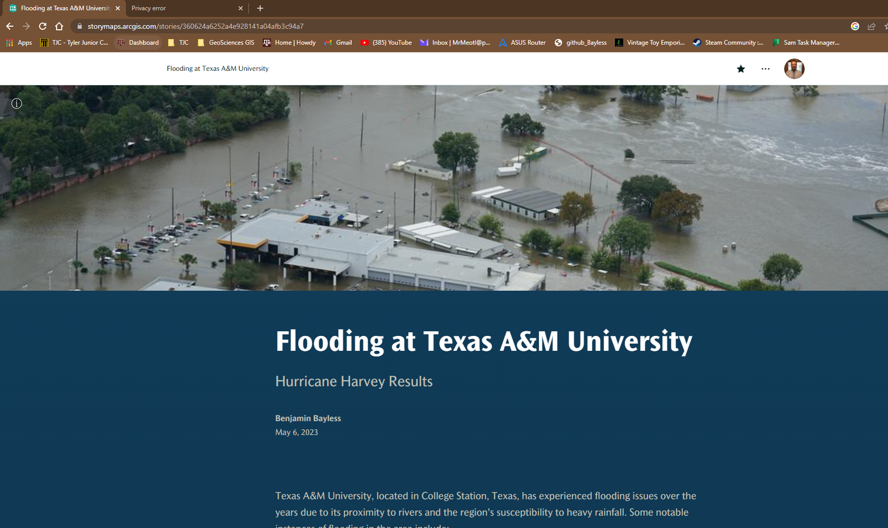
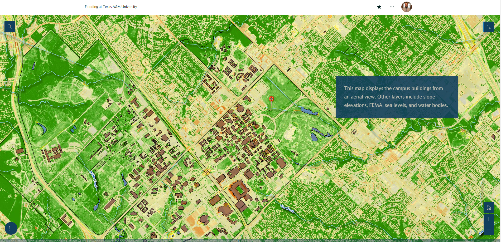
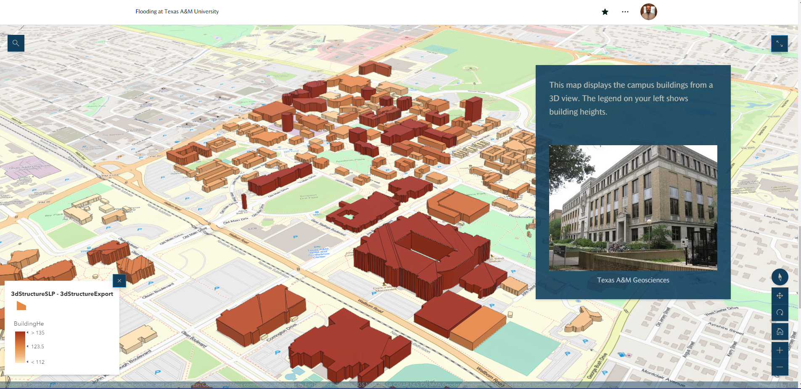

# GEOG_678 WEBGIS BKB

**LAB 7 - ArcGIS Story Map**

**Task 1 - Family Vacation 2D Map**

***[My Story Map Link](https://storymaps.arcgis.com/stories/4b7f7e108ecb4d248664f8ad72d04b18)***

Task 2: TAMU Campus Story Map 3D

***[My 3D Map Story Link](https://storymaps.arcgis.com/stories/360624a6252a4e928141a04afb3c94a7)***

